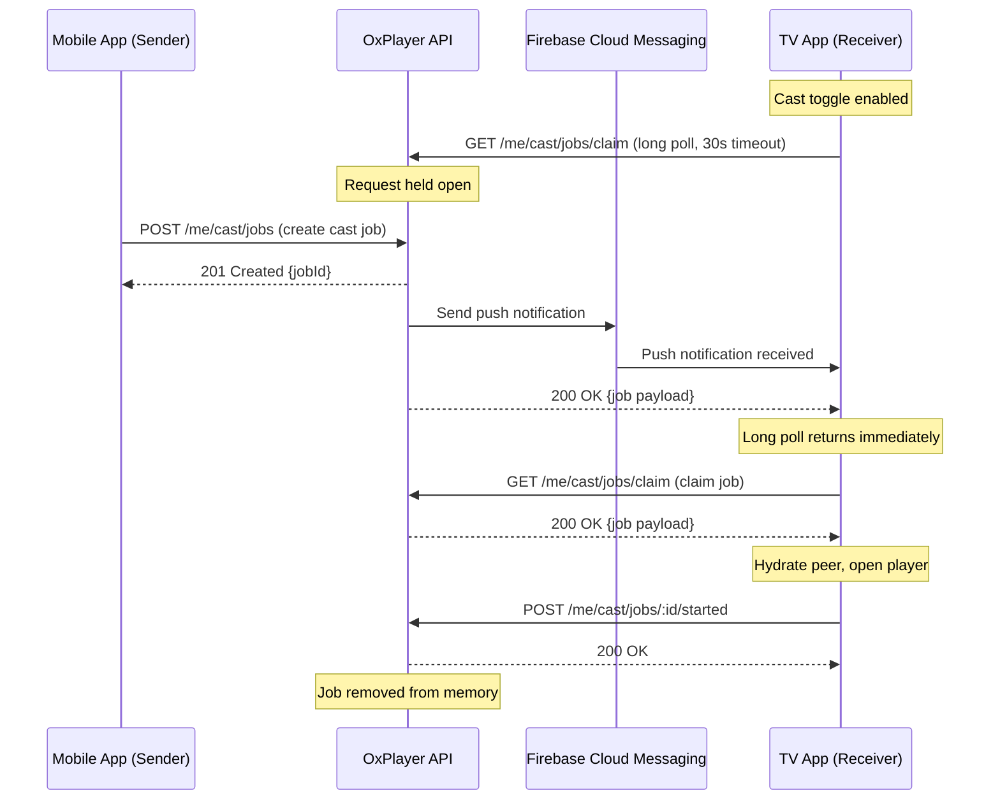

# Design Document: Relay TV Cast

## Overview

The Relay TV Cast feature enables users to send media from their mobile or tablet device to their TV using a relay-based architecture. Unlike traditional casting protocols (Chromecast, AirPlay), this system uses a backend relay server to coordinate the handoff between sender and receiver devices.

### Key Design Principles

1. **Simplicity**: No peer-to-peer discovery or complex NAT traversal
2. **Reliability**: Backend relay ensures delivery even across different networks
3. **Instant Delivery**: Dual-channel approach (long polling + FCM push) for minimal latency
4. **Atomic Claiming**: First-come-first-served job claiming prevents duplicate playback
5. **Graceful Degradation**: Falls back to long polling when FCM is unavailable

### Architecture Diagram



## Architecture

### System Components

#### 1. Sender (Mobile/Tablet App)

**Responsibilities:**
- Display cast button on file preview cards
- Create cast jobs via POST /me/cast/jobs
- Handle success/error responses
- Disable cast button during active cast

**Key Classes:**
- `CastService`: Manages cast job creation and state
- `FilePreviewCard`: UI widget with cast button

#### 2. Receiver (TV App)

**Responsibilities:**
- Poll for cast jobs via long polling
- Register for FCM push notifications
- Claim cast jobs atomically
- Hydrate peer connection before playback
- Maintain foreground service during polling
- Handle exponential backoff on errors

**Key Classes:**
- `CastReceiverService`: Manages polling, FCM, and job claiming
- `CastForegroundService`: Android foreground service for background polling
- `CastSettingsProvider`: Manages cast toggle state

#### 3. Backend (OxPlayer API Server)

**Responsibilities:**
- Store cast jobs in memory (keyed by userId)
- Handle long polling requests (30s timeout)
- Send FCM push notifications when jobs are created
- Implement atomic claim operation
- Auto-expire jobs after 5 minutes

**Technology:**
- Go HTTP server (extends existing server/main.go)
- In-memory job storage (map[userId]CastJob)
- FCM Admin SDK for push notifications

### Data Flow

1. **Job Creation Flow:**
   - Sender taps cast button → POST /me/cast/jobs
   - Backend stores job in memory, returns 201
   - Backend sends FCM push to all registered receivers
   - Backend immediately responds to any active long polling requests

2. **Job Delivery Flow (Dual Channel):**
   - **Channel 1 (Long Polling):** TV polls GET /me/cast/jobs/claim with 30s timeout
   - **Channel 2 (FCM Push):** TV receives push notification, immediately calls GET /me/cast/jobs/claim
   - First channel to respond wins (atomic claim)

3. **Job Claiming Flow:**
   - TV calls GET /me/cast/jobs/claim
   - Backend atomically assigns job to that receiver, removes from available jobs
   - Subsequent claim attempts return 404

4. **Playback Flow:**
   - TV hydrates peer connection (resolve fileId to peer info + metadata)
   - TV stops current playback (if any)
   - TV opens player with hydrated metadata
   - TV sends POST /me/cast/jobs/:id/started (fire-and-forget with retries)

## Components and Interfaces

### Backend API Endpoints

#### POST /me/cast/jobs

Create a new cast job.

**Request:**
```json
{
  "chatId": "string",
  "messageId": "number",
  "fileId": "string",
  "fileName": "string",
  "mimeType": "string",
  "totalBytes": "number",
  "thumbnailUrl": "string?",
  "metadata": {
    "title": "string?",
    "duration": "number?"
  }
}
```

**Response (201 Created):**
```json
{
  "jobId": "uuid",
  "createdAt": "timestamp"
}
```

**Error Responses:**
- 400 Bad Request: Invalid payload
- 401 Unauthorized: Missing or invalid auth token
- 500 Internal Server Error: Server error

#### GET /me/cast/jobs/claim

Claim the next available cast job for the authenticated user. Supports long polling.

**Query Parameters:**
- `timeout`: Optional, default 30 (seconds). Max 60.

**Response (200 OK):**
```json
{
  "jobId": "uuid",
  "chatId": "string",
  "messageId": "number",
  "fileId": "string",
  "fileName": "string",
  "mimeType": "string",
  "totalBytes": "number",
  "thumbnailUrl": "string?",
  "metadata": {
    "title": "string?",
    "duration": "number?"
  },
  "createdAt": "timestamp"
}
```

**Response (204 No Content):**
No job available (long polling timeout or no job exists).

**Response (404 Not Found):**
Job was already claimed by another receiver.

**Error Responses:**
- 401 Unauthorized: Missing or invalid auth token
- 500 Internal Server Error: Server error

**Long Polling Behavior:**
- If a job exists, respond immediately with 200
- If no job exists, hold the request open for up to `timeout` seconds
- If a job is created while request is held, respond immediately with 200
- If timeout expires with no job, respond with 204

#### POST /me/cast/jobs/:id/started

Acknowledge that playback has started for a cast job.

**Request:** Empty body

**Response (200 OK):**
```json
{
  "acknowledged": true
}
```

**Error Responses:**
- 401 Unauthorized: Missing or invalid auth token
- 500 Internal Server Error: Server error

**Note:** This endpoint is idempotent. Returns 200 even if the job doesn't exist (already removed).

#### POST /me/devices/register

Register a device for FCM push notifications.

**Request:**
```json
{
  "deviceId": "string",
  "fcmToken": "string",
  "platform": "android",
  "appVersion": "string"
}
```

**Response (200 OK):**
```json
{
  "registered": true
}
```

**Error Responses:**
- 400 Bad Request: Invalid payload
- 401 Unauthorized: Missing or invalid auth token
- 500 Internal Server Error: Server error

### Flutter/Dart Implementation

#### CastService

Manages cast job creation and state for the sender.

```dart
class CastService {
  final Dio _dio;
  final String _baseUrl;
  
  // Track active cast jobs to disable button
  final Map<String, String> _activeCastJobs = {}; // fileId -> jobId
  
  Future<String> createCastJob({
    required String chatId,
    required int messageId,
    required String fileId,
    required String fileName,
    required String mimeType,
    required int totalBytes,
    String? thumbnailUrl,
    Map<String, dynamic>? metadata,
  }) async {
    final response = await _dio.post(
      '$_baseUrl/me/cast/jobs',
      data: {
        'chatId': chatId,
        'messageId': messageId,
        'fileId': fileId,
        'fileName': fileName,
        'mimeType': mimeType,
        'totalBytes': totalBytes,
        'thumbnailUrl': thumbnailUrl,
        'metadata': metadata,
      },
    );
    
    if (response.statusCode == 201) {
      final jobId = response.data['jobId'] as String;
      _activeCastJobs[fileId] = jobId;
      return jobId;
    }
    
    throw CastException('Failed to create cast job: ${response.statusCode}');
  }
  
  bool isCasting(String fileId) => _activeCastJobs.containsKey(fileId);
  
  void clearCastJob(String fileId) => _activeCastJobs.remove(fileId);
}
```

#### CastReceiverService

Manages polling, FCM, and job claiming for the receiver.

```dart
class CastReceiverService extends ChangeNotifier {
  final Dio _dio;
  final String _baseUrl;
  final SettingsService _settingsService;
  
  bool _isPolling = false;
  bool _isCastEnabled = false;
  Timer? _pollTimer;
  int _backoffSeconds = 1;
  static const int _maxBackoffSeconds = 60;
  
  CastReceiverService({
    required Dio dio,
    required String baseUrl,
    required SettingsService settingsService,
  }) : _dio = dio,
       _baseUrl = baseUrl,
       _settingsService = settingsService {
    _isCastEnabled = _settingsService.getCastToggleEnabled();
    if (_isCastEnabled) {
      startPolling();
    }
  }
  
  bool get isCastEnabled => _isCastEnabled;
  bool get isPolling => _isPolling;
  
  Future<void> setCastEnabled(bool enabled) async {
    _isCastEnabled = enabled;
    await _settingsService.setCastToggleEnabled(enabled);
    
    if (enabled) {
      await startPolling();
    } else {
      await stopPolling();
    }
    
    notifyListeners();
  }
  
  Future<void> startPolling() async {
    if (_isPolling) return;
    
    _isPolling = true;
    _backoffSeconds = 1;
    await CastForegroundService.start();
    _poll();
    notifyListeners();
  }
  
  Future<void> stopPolling() async {
    if (!_isPolling) return;
    
    _isPolling = false;
    _pollTimer?.cancel();
    _pollTimer = null;
    await CastForegroundService.stop();
    notifyListeners();
  }
  
  Future<void> _poll() async {
    if (!_isPolling) return;
    
    try {
      final response = await _dio.get(
        '$_baseUrl/me/cast/jobs/claim',
        queryParameters: {'timeout': 30},
        options: Options(
          receiveTimeout: const Duration(seconds: 35),
        ),
      );
      
      if (response.statusCode == 200) {
        // Job received
        _backoffSeconds = 1; // Reset backoff
        final job = CastJob.fromJson(response.data);
        await _handleCastJob(job);
        // Immediately poll again
        _poll();
      } else if (response.statusCode == 204) {
        // No job available, poll again immediately
        _backoffSeconds = 1;
        _poll();
      }
    } on DioException catch (e) {
      if (e.response?.statusCode == 401) {
        // Auth error, stop polling
        appLogger.e('Cast polling: Auth error, stopping');
        await stopPolling();
        return;
      }
      
      // Network error, retry with exponential backoff
      appLogger.w('Cast polling error: ${e.message}');
      _pollTimer = Timer(Duration(seconds: _backoffSeconds), _poll);
      _backoffSeconds = (_backoffSeconds * 2).clamp(1, _maxBackoffSeconds);
    }
  }
  
  Future<void> _handleCastJob(CastJob job) async {
    try {
      // Show "Cast in progress..." notification
      await _showCastNotification('Cast in progress...');
      
      // Hydrate peer connection
      final hydratedFile = await _hydratePeer(job);
      
      // Stop current playback
      await _stopCurrentPlayback();
      
      // Open player with hydrated metadata
      await _openPlayer(hydratedFile);
      
      // Acknowledge job started (fire-and-forget with retries)
      _acknowledgeJobStarted(job.jobId);
      
      // Show success notification
      await _showCastNotification('Now playing: ${job.fileName}');
    } catch (e) {
      appLogger.e('Failed to handle cast job', error: e);
      await _showCastNotification('Cast failed: ${e.toString()}');
    }
  }
  
  Future<HydratedFile> _hydratePeer(CastJob job) async {
    // Resolve fileId to peer connection info and metadata
    // This uses existing Telegram peer hydration logic
    // Retry up to 3 times on network errors
    for (int attempt = 0; attempt < 3; attempt++) {
      try {
        return await TelegramService.instance.hydrateFile(
          chatId: job.chatId,
          messageId: job.messageId,
          fileId: job.fileId,
        );
      } catch (e) {
        if (attempt == 2) rethrow;
        await Future.delayed(Duration(seconds: attempt + 1));
      }
    }
    throw Exception('Failed to hydrate peer after 3 attempts');
  }
  
  Future<void> _stopCurrentPlayback() async {
    // Stop any currently playing media
    // This uses existing player service
    await PlayerService.instance.stop();
  }
  
  Future<void> _openPlayer(HydratedFile file) async {
    // Open player with hydrated metadata
    // This uses existing player navigation
    await Navigator.pushNamed(
      context,
      '/player',
      arguments: PlayerArguments(file: file),
    );
  }
  
  void _acknowledgeJobStarted(String jobId) {
    // Fire-and-forget with retries
    _retryAcknowledge(jobId, attempts: 0);
  }
  
  Future<void> _retryAcknowledge(String jobId, {required int attempts}) async {
    if (attempts >= 3) return;
    
    try {
      await _dio.post('$_baseUrl/me/cast/jobs/$jobId/started');
    } catch (e) {
      appLogger.w('Failed to acknowledge job $jobId (attempt ${attempts + 1})');
      await Future.delayed(Duration(seconds: (attempts + 1) * 2));
      _retryAcknowledge(jobId, attempts: attempts + 1);
    }
  }
  
  Future<void> _showCastNotification(String message) async {
    // Show Android notification
    await CastNotificationService.show(message);
  }
  
  Future<void> handleFCMPush() async {
    // Called when FCM push notification is received
    // Immediately claim the job (bypasses long polling)
    try {
      final response = await _dio.get('$_baseUrl/me/cast/jobs/claim');
      
      if (response.statusCode == 200) {
        final job = CastJob.fromJson(response.data);
        await _handleCastJob(job);
      }
    } catch (e) {
      appLogger.e('Failed to handle FCM push', error: e);
    }
  }
  
  @override
  void dispose() {
    stopPolling();
    super.dispose();
  }
}
```

#### CastForegroundService

Android foreground service to prevent Doze mode from terminating polling.

```dart
class CastForegroundService {
  static const MethodChannel _channel = MethodChannel('com.plezy/cast_service');
  
  static Future<void> start() async {
    try {
      await _channel.invokeMethod('startForegroundService');
    } catch (e) {
      appLogger.e('Failed to start cast foreground service', error: e);
    }
  }
  
  static Future<void> stop() async {
    try {
      await _channel.invokeMethod('stopForegroundService');
    } catch (e) {
      appLogger.e('Failed to stop cast foreground service', error: e);
    }
  }
}
```

**Android Implementation (Kotlin):**

```kotlin
class CastForegroundService : Service() {
    companion object {
        private const val NOTIFICATION_ID = 1001
        private const val CHANNEL_ID = "cast_receiver_channel"
        
        fun start(context: Context) {
            val intent = Intent(context, CastForegroundService::class.java)
            if (Build.VERSION.SDK_INT >= Build.VERSION_CODES.O) {
                context.startForegroundService(intent)
            } else {
                context.startService(intent)
            }
        }
        
        fun stop(context: Context) {
            val intent = Intent(context, CastForegroundService::class.java)
            context.stopService(intent)
        }
    }
    
    override fun onCreate() {
        super.onCreate()
        createNotificationChannel()
        startForeground(NOTIFICATION_ID, createNotification())
    }
    
    override fun onStartCommand(intent: Intent?, flags: Int, startId: Int): Int {
        return START_STICKY
    }
    
    override fun onBind(intent: Intent?): IBinder? = null
    
    private fun createNotificationChannel() {
        if (Build.VERSION.SDK_INT >= Build.VERSION_CODES.O) {
            val channel = NotificationChannel(
                CHANNEL_ID,
                "Cast Receiver",
                NotificationManager.IMPORTANCE_LOW
            ).apply {
                description = "Keeps the app ready to receive cast requests"
            }
            
            val manager = getSystemService(NotificationManager::class.java)
            manager.createNotificationChannel(channel)
        }
    }
    
    private fun createNotification(): Notification {
        return NotificationCompat.Builder(this, CHANNEL_ID)
            .setContentTitle("Ready to Cast")
            .setContentText("Your TV is ready to receive cast requests")
            .setSmallIcon(R.drawable.ic_cast)
            .setPriority(NotificationCompat.PRIORITY_LOW)
            .setOngoing(true)
            .build()
    }
}
```

#### FCM Integration

```dart
class CastFCMService {
  static Future<void> initialize() async {
    if (!Platform.isAndroid) return;
    
    final messaging = FirebaseMessaging.instance;
    
    // Request permission
    await messaging.requestPermission(
      alert: true,
      badge: true,
      sound: true,
    );
    
    // Get FCM token
    final token = await messaging.getToken();
    if (token != null) {
      await _registerDevice(token);
    }
    
    // Listen for token refresh
    messaging.onTokenRefresh.listen(_registerDevice);
    
    // Listen for foreground messages
    FirebaseMessaging.onMessage.listen((message) {
      if (message.data['type'] == 'cast_job') {
        CastReceiverService.instance.handleFCMPush();
      }
    });
    
    // Listen for background messages
    FirebaseMessaging.onBackgroundMessage(_handleBackgroundMessage);
  }
  
  static Future<void> _registerDevice(String fcmToken) async {
    final dio = Dio();
    final deviceId = await _getDeviceId();
    final appVersion = await _getAppVersion();
    
    try {
      await dio.post(
        '${Config.apiBaseUrl}/me/devices/register',
        data: {
          'deviceId': deviceId,
          'fcmToken': fcmToken,
          'platform': 'android',
          'appVersion': appVersion,
        },
      );
    } catch (e) {
      appLogger.e('Failed to register FCM token', error: e);
    }
  }
  
  static Future<String> _getDeviceId() async {
    final deviceInfo = DeviceInfoPlugin();
    final androidInfo = await deviceInfo.androidInfo;
    return androidInfo.id;
  }
  
  static Future<String> _getAppVersion() async {
    final packageInfo = await PackageInfo.fromPlatform();
    return packageInfo.version;
  }
}

@pragma('vm:entry-point')
Future<void> _handleBackgroundMessage(RemoteMessage message) async {
  if (message.data['type'] == 'cast_job') {
    // Wake up the app to handle the cast job
    // This will trigger CastReceiverService.handleFCMPush()
  }
}
```

#### Settings Integration

Add cast toggle to SettingsService:

```dart
// In SettingsService class
static const String _keyCastToggleEnabled = 'cast_toggle_enabled';

Future<void> setCastToggleEnabled(bool enabled) async {
  await prefs.setBool(_keyCastToggleEnabled, enabled);
}

bool getCastToggleEnabled() {
  // Default to enabled on TV, disabled elsewhere
  return prefs.getBool(_keyCastToggleEnabled) ?? TvDetectionService.isTVSync();
}
```

## Data Models

### CastJob

```dart
class CastJob {
  final String jobId;
  final String chatId;
  final int messageId;
  final String fileId;
  final String fileName;
  final String mimeType;
  final int totalBytes;
  final String? thumbnailUrl;
  final Map<String, dynamic>? metadata;
  final DateTime createdAt;
  
  CastJob({
    required this.jobId,
    required this.chatId,
    required this.messageId,
    required this.fileId,
    required this.fileName,
    required this.mimeType,
    required this.totalBytes,
    this.thumbnailUrl,
    this.metadata,
    required this.createdAt,
  });
  
  factory CastJob.fromJson(Map<String, dynamic> json) {
    return CastJob(
      jobId: json['jobId'] as String,
      chatId: json['chatId'] as String,
      messageId: json['messageId'] as int,
      fileId: json['fileId'] as String,
      fileName: json['fileName'] as String,
      mimeType: json['mimeType'] as String,
      totalBytes: json['totalBytes'] as int,
      thumbnailUrl: json['thumbnailUrl'] as String?,
      metadata: json['metadata'] as Map<String, dynamic>?,
      createdAt: DateTime.parse(json['createdAt'] as String),
    );
  }
  
  Map<String, dynamic> toJson() {
    return {
      'jobId': jobId,
      'chatId': chatId,
      'messageId': messageId,
      'fileId': fileId,
      'fileName': fileName,
      'mimeType': mimeType,
      'totalBytes': totalBytes,
      'thumbnailUrl': thumbnailUrl,
      'metadata': metadata,
      'createdAt': createdAt.toIso8601String(),
    };
  }
}
```

### HydratedFile

```dart
class HydratedFile {
  final String fileId;
  final String fileName;
  final String mimeType;
  final int totalBytes;
  final PeerConnection peerConnection;
  final Map<String, dynamic>? metadata;
  
  HydratedFile({
    required this.fileId,
    required this.fileName,
    required this.mimeType,
    required this.totalBytes,
    required this.peerConnection,
    this.metadata,
  });
}
```

### CastException

```dart
class CastException implements Exception {
  final String message;
  final Object? originalError;
  
  CastException(this.message, [this.originalError]);
  
  @override
  String toString() => 'CastException: $message';
}
```

## Error Handling

### Sender Error Handling

1. **Network Errors:**
   - Display toast: "Cast service unavailable"
   - Log error for debugging
   - Re-enable cast button

2. **Auth Errors (401):**
   - Display toast: "Authentication required"
   - Prompt user to re-login

3. **Server Errors (500):**
   - Display toast: "Cast failed, please try again"
   - Log error for debugging

### Receiver Error Handling

1. **Network Errors During Polling:**
   - Retry with exponential backoff (1s, 2s, 4s, ..., max 60s)
   - Continue retrying indefinitely while cast toggle is enabled
   - Auto-resume when connectivity is restored

2. **Auth Errors (401):**
   - Stop polling
   - Display notification: "Cast receiver: Authentication error"
   - Disable cast toggle

3. **Peer Hydration Errors:**
   - Retry up to 3 times with 1s, 2s, 3s delays
   - If all retries fail, display notification: "Cast failed: Unable to load media"
   - Continue polling for next job

4. **Playback Errors:**
   - Display notification: "Cast failed: Playback error"
   - Continue polling for next job

### Backend Error Handling

1. **Job Expiration:**
   - Auto-remove jobs older than 5 minutes
   - Prevents stale job accumulation

2. **FCM Errors:**
   - Log error but don't fail the request
   - Long polling ensures delivery even if FCM fails

3. **Concurrent Claim Attempts:**
   - Use mutex to ensure atomic claim operation
   - First claim succeeds with 200, subsequent claims return 404

## Correctness Properties

*A property is a characteristic or behavior that should hold true across all valid executions of a system—essentially, a formal statement about what the system should do. Properties serve as the bridge between human-readable specifications and machine-verifiable correctness guarantees.*

### Property Reflection

After analyzing all acceptance criteria, I identified the following redundancies:
- Properties 4.3 and 12.2 both test that subsequent claims return 404 (consolidated into Property 4)
- Properties 3.4 and 12.1 both test broadcast delivery to all receivers (consolidated into Property 3)
- Properties 2.3 and 11.2 both test exponential backoff (consolidated into Property 2)
- Properties 5.1, 5.2, 5.4 can be combined into a single comprehensive hydration property (Property 5)
- Properties 6.1, 6.2, 6.3 can be combined into a single playback preemption property (Property 6)

### Property 1: Cast Job Creation Request Structure

*For any* valid media payload (chatId, messageId, fileId, fileName, mimeType, totalBytes), when the user triggers a cast action, the sender SHALL send a POST request to /me/cast/jobs with the correct payload structure.

**Validates: Requirements 1.1**

### Property 2: Exponential Backoff on Network Errors

*For any* sequence of network errors during polling or job creation, the receiver SHALL retry with exponential backoff starting at 1 second, doubling on each failure, up to a maximum of 60 seconds.

**Validates: Requirements 2.3, 11.2**

### Property 3: Broadcast Delivery to All Receivers

*For any* cast job and any number of active polling receivers for the same user, the backend SHALL deliver the job to all receivers simultaneously until one claims it.

**Validates: Requirements 3.1, 3.4, 3.5, 12.1**

### Property 4: Atomic Job Claiming

*For any* cast job and any number of concurrent claim attempts, exactly one receiver SHALL successfully claim the job (receiving HTTP 200 with the job payload), and all subsequent claim attempts SHALL receive HTTP 404.

**Validates: Requirements 4.1, 4.2, 4.3, 4.4, 12.2**

### Property 5: Peer Hydration Completeness

*For any* cast job, when the receiver claims it, the receiver SHALL resolve the fileId to a complete hydrated file containing totalBytes, mimeType, and peer connection details before opening the player.

**Validates: Requirements 5.1, 5.2, 5.4**

### Property 6: Playback Preemption

*For any* receiver state with active playback or queued operations, when a cast job is claimed, the receiver SHALL immediately stop current playback, cancel queued operations, and open the player with the cast job's media.

**Validates: Requirements 6.1, 6.2, 6.3**

### Property 7: Acknowledgment Idempotency

*For any* job ID (existing or non-existent), when the receiver sends a POST request to /me/cast/jobs/:id/started, the backend SHALL return HTTP 200.

**Validates: Requirements 7.2, 7.3**

### Property 8: Acknowledgment Retry Pattern

*For any* acknowledgment request that fails, the receiver SHALL retry up to 3 times with exponential backoff, without blocking playback.

**Validates: Requirements 7.4, 7.5**

### Property 9: Toggle State Persistence

*For any* cast toggle state (enabled or disabled), when the app is restarted, the toggle state SHALL be preserved.

**Validates: Requirements 8.5**

### Property 10: Cast Button State for Active Jobs

*For any* file with an active cast job in progress, the sender SHALL disable the cast button and display a "Casting..." indicator.

**Validates: Requirements 9.3**

### Property 11: Cast Button Visibility by Media Type

*For any* media item, the sender SHALL display the cast button if and only if the media type is video or audio.

**Validates: Requirements 9.4**

### Property 12: FCM Token Registration

*For any* FCM token obtained or refreshed, the receiver SHALL send a POST request to /me/devices/register with the token and device metadata.

**Validates: Requirements 10.2, 10.3**

### Property 13: Hydration Retry on Network Errors

*For any* peer hydration operation that fails due to a network error, the receiver SHALL retry up to 3 times before displaying an error notification.

**Validates: Requirements 11.3**

### Property 14: Network Resilience

*For any* connectivity loss and restoration cycle, when connectivity is restored, the receiver SHALL automatically resume polling.

**Validates: Requirements 11.4**

### Property 15: Job Expiration

*For any* cast job, if the job age exceeds 5 minutes, the backend SHALL automatically remove it from memory.

**Validates: Requirements 11.5**

### Property 16: Concurrent Connection Support

*For any* user with multiple receiver devices, the backend SHALL support concurrent polling connections (one per device).

**Validates: Requirements 12.3**

### Property 17: Post-Claim Notification

*For any* cast job claim, when one receiver successfully claims the job, the backend SHALL immediately respond to all other pending polling requests with HTTP 204.

**Validates: Requirements 12.4**

### Property 18: Immediate Re-polling on 204

*For any* HTTP 204 response received during polling, the receiver SHALL immediately initiate a new polling request.

**Validates: Requirements 12.5**

### Property 19: Polling Loop Continuity

*For any* long polling request that times out without receiving a job, the receiver SHALL immediately initiate a new long polling request.

**Validates: Requirements 2.2**

### Property 20: Toggle Enable Starts Polling

*For any* receiver state, when the cast toggle is enabled, the receiver SHALL start the polling service and display a "Ready to Cast" indicator.

**Validates: Requirements 8.3**

### Property 21: Toggle Disable Stops Polling

*For any* receiver state, when the cast toggle is disabled, the receiver SHALL stop the polling service, cancel all active polling requests, and hide the "Ready to Cast" indicator.

**Validates: Requirements 2.6, 8.4**

### Property 22: FCM Notification Triggers Claim

*For any* FCM notification received with type "cast_job", the receiver SHALL immediately call GET /me/cast/jobs/claim to retrieve the job.

**Validates: Requirements 3.3**

### Property 23: Hydration Failure Prevents Playback

*For any* peer hydration operation that fails (after all retries), the receiver SHALL display an error notification and SHALL NOT open the player.

**Validates: Requirements 5.3**

### Property 24: Job ID Storage After Claim

*For any* successfully claimed cast job, the receiver SHALL store the job ID for acknowledgment.

**Validates: Requirements 4.5**

### Property 25: Hydration Progress Notification

*For any* peer hydration operation in progress, the receiver SHALL display a "Cast in progress..." notification.

**Validates: Requirements 5.5**

### Property 26: Preemption Notification

*For any* playback preemption caused by a cast job, the receiver SHALL display a notification indicating that playback was preempted.

**Validates: Requirements 6.4**

### Property 27: Playback Start Triggers Acknowledgment

*For any* successful playback start from a cast job, the receiver SHALL send a POST request to /me/cast/jobs/:id/started.

**Validates: Requirements 7.1**

### Property 28: Backend Error Response Codes

*For any* invalid cast job creation payload, the backend SHALL return HTTP 400; for any server error, the backend SHALL return HTTP 500.

**Validates: Requirements 1.4**

### Property 29: Successful Job Creation Response

*For any* valid cast job creation request, the backend SHALL return HTTP 201 with a unique job ID.

**Validates: Requirements 1.3**

### Property 30: Backend Unavailable Error Display

*For any* scenario where the backend is unreachable during cast job creation, the sender SHALL display a "Cast service unavailable" error.

**Validates: Requirements 11.1**

## Testing Strategy

### Dual Testing Approach

This feature requires both unit tests and property-based tests for comprehensive coverage:
- **Unit tests**: Verify specific examples, edge cases, and error conditions
- **Property tests**: Verify universal properties across all inputs

### Property-Based Testing

**Library Selection:**
- Dart: Use `test` package with custom property test helpers (or `fast_check` port if available)
- Go (Backend): Use `gopter` library for property-based testing

**Test Configuration:**
- Minimum 100 iterations per property test (due to randomization)
- Each property test must reference its design document property
- Tag format: `// Feature: relay-tv-cast, Property {number}: {property_text}`

**Property Test Implementation:**

Each correctness property (1-30) must be implemented as a property-based test. Examples:

```dart
// Feature: relay-tv-cast, Property 1: Cast Job Creation Request Structure
test('cast job creation sends correct POST structure', () {
  fc.assert(
    fc.property(
      fc.record({
        'chatId': fc.string(),
        'messageId': fc.integer(),
        'fileId': fc.string(),
        'fileName': fc.string(),
        'mimeType': fc.string(),
        'totalBytes': fc.integer(min: 1),
      }),
      (payload) async {
        final service = CastService(dio: mockDio, baseUrl: testUrl);
        await service.createCastJob(
          chatId: payload['chatId'],
          messageId: payload['messageId'],
          fileId: payload['fileId'],
          fileName: payload['fileName'],
          mimeType: payload['mimeType'],
          totalBytes: payload['totalBytes'],
        );
        
        verify(mockDio.post(
          '$testUrl/me/cast/jobs',
          data: argThat(containsPair('chatId', payload['chatId'])),
        )).called(1);
      },
    ),
    numRuns: 100,
  );
});

// Feature: relay-tv-cast, Property 4: Atomic Job Claiming
test('exactly one receiver claims job from concurrent attempts', () {
  fc.assert(
    fc.property(
      fc.integer(min: 2, max: 10), // number of concurrent claimers
      (numClaimers) async {
        final backend = TestBackend();
        final jobId = await backend.createJob(testUserId, testPayload);
        
        // Simulate concurrent claim attempts
        final results = await Future.wait(
          List.generate(numClaimers, (_) => backend.claimJob(testUserId)),
        );
        
        final successCount = results.where((r) => r.statusCode == 200).length;
        final notFoundCount = results.where((r) => r.statusCode == 404).length;
        
        expect(successCount, equals(1)); // Exactly one success
        expect(notFoundCount, equals(numClaimers - 1)); // All others get 404
      },
    ),
    numRuns: 100,
  );
});
```

### Unit Tests

1. **CastService Tests:**
   - Test createCastJob with valid payload
   - Test createCastJob with network error
   - Test isCasting returns correct state
   - Test clearCastJob removes job

2. **CastReceiverService Tests:**
   - Test startPolling starts foreground service
   - Test stopPolling stops foreground service
   - Test exponential backoff on network errors
   - Test auth error stops polling
   - Test handleFCMPush claims job immediately

3. **Backend Tests:**
   - Test POST /me/cast/jobs creates job
   - Test GET /me/cast/jobs/claim returns job immediately when available
   - Test GET /me/cast/jobs/claim holds request when no job available
   - Test GET /me/cast/jobs/claim times out after 30s
   - Test atomic claim operation (first claim succeeds, second returns 404)
   - Test job expiration after 5 minutes
   - Test FCM push sent when job created

### Integration Tests

1. **End-to-End Cast Flow:**
   - Sender creates job → Backend stores job → Receiver claims job → Playback starts
   - Verify job is removed after acknowledgment

2. **Multi-Device Coordination:**
   - Multiple receivers polling → First to claim wins → Others receive 404

3. **FCM + Long Polling:**
   - Job created → FCM push sent → Receiver claims via FCM → Long polling request returns 204

4. **Network Resilience:**
   - Disconnect network → Receiver retries with backoff → Reconnect → Polling resumes

### Manual Testing

1. **Cast Button UI:**
   - Verify cast button appears on file preview cards
   - Verify cast button is disabled during active cast
   - Verify cast button is hidden on TV devices

2. **Cast Toggle:**
   - Verify toggle appears in Settings
   - Verify toggle defaults to enabled on TV
   - Verify enabling toggle starts polling
   - Verify disabling toggle stops polling

3. **Foreground Service:**
   - Verify "Ready to Cast" notification appears when polling
   - Verify notification disappears when polling stops

4. **Playback Preemption:**
   - Start playing media on TV → Cast new media → Verify current playback stops

5. **Error Notifications:**
   - Trigger peer hydration error → Verify error notification appears
   - Trigger auth error → Verify polling stops and error notification appears

## Performance Considerations

### Long Polling Optimization

1. **Connection Pooling:**
   - Reuse HTTP connections for polling requests
   - Reduces connection overhead

2. **Timeout Tuning:**
   - 30s timeout balances responsiveness and server load
   - Immediate re-poll after timeout ensures no gaps

3. **Exponential Backoff:**
   - Prevents thundering herd on server errors
   - Max 60s backoff prevents excessive delays

### Memory Management

1. **Job Expiration:**
   - Auto-remove jobs after 5 minutes
   - Prevents unbounded memory growth

2. **FCM Token Storage:**
   - Store tokens in database (not in-memory)
   - Persist across server restarts

### Battery Optimization

1. **Foreground Service:**
   - Prevents Android Doze from killing polling
   - Low-priority notification minimizes user disruption

2. **FCM Push:**
   - Reduces polling frequency when FCM is available
   - Instant delivery without constant polling

## Security Considerations

1. **Authentication:**
   - All API endpoints require valid auth token
   - Tokens validated on every request

2. **Authorization:**
   - Jobs are scoped to userId
   - Users can only claim their own jobs

3. **Rate Limiting:**
   - Prevent abuse of cast job creation
   - Limit: 10 jobs per minute per user

4. **Input Validation:**
   - Validate all cast job fields
   - Sanitize file names and metadata

5. **FCM Token Security:**
   - Tokens stored securely in database
   - Tokens never exposed in API responses

## Deployment Considerations

1. **Backend Deployment:**
   - Add cast job endpoints to existing Go server
   - Deploy FCM Admin SDK credentials
   - Configure job expiration cron job

2. **Mobile App Deployment:**
   - Add FCM dependencies to pubspec.yaml
   - Configure FCM in google-services.json
   - Add foreground service to AndroidManifest.xml

3. **Feature Flag:**
   - Hide cast button behind feature flag initially
   - Enable for beta testers first
   - Gradual rollout to all users

## Future Enhancements

1. **Cast History:**
   - Show recent cast jobs in UI
   - Allow re-casting from history

2. **Cast Queue:**
   - Queue multiple items for sequential playback
   - Receiver plays queue in order

3. **Cast Controls:**
   - Sender can pause/resume/stop playback on receiver
   - Requires WebSocket connection for real-time control

4. **Multi-Room Cast:**
   - Cast to multiple TVs simultaneously
   - Synchronized playback across devices

5. **Cast Discovery:**
   - Show list of available receivers in sender UI
   - Allow user to select specific receiver

